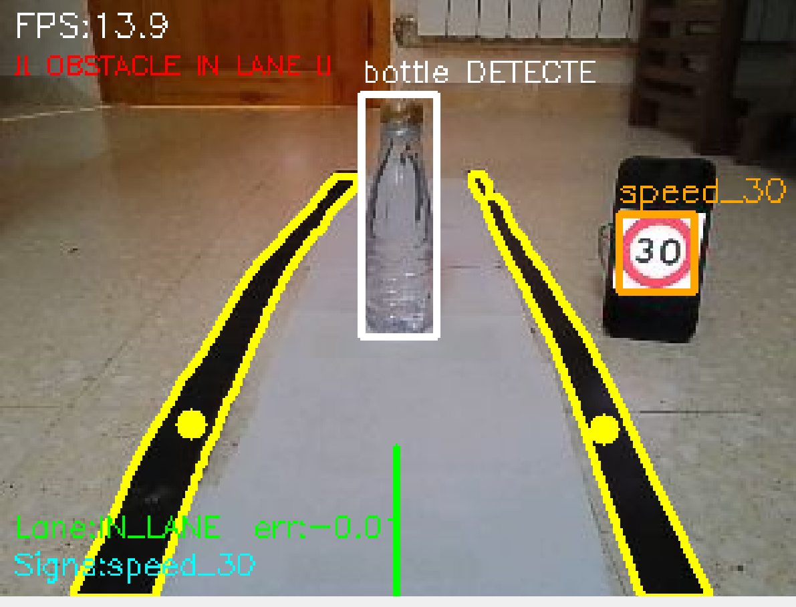

# esibot_vision

ROS 2 Jazzy vision package for the EsiBot robot.

Real-time detection:
- **Lane**: black tape on a white background (OpenCV)
- **Traffic signs**: YOLOv8n fine-tuned on GTSRB (8 classes)
- **Obstacles**: YOLOv8n COCO - only between the two lane tapes

---

## Detected signs

| Sign                | Image                                                   | Label       |
| ------------------- | ------------------------------------------------------- | ----------- |
| Stop                |       | `stop`      |
| Speed limit 30 km/h |   | `speed_30`  |
| Turn right          |  | `dir_right` |

Full class list: `speed_30` `speed_50` `speed_70` `speed_80` `stop` `dir_straight` `dir_right` `dir_left`

---

## Prerequisites

- Ubuntu 24.04 + ROS 2 Jazzy
- `esibot_camera` running (provides `/camera/image_raw`)
- Python: `opencv-python`, `numpy`, `ultralytics` (YOLOv8)

---

## Install on Raspberry Pi

### 1. System dependencies

```bash
sudo apt update
sudo apt install -y python3-pip python3-numpy python3-opencv
```

### 2. PyTorch CPU-only (~190 MB - required, no GPU on Raspberry Pi)

```bash
pip3 install torch torchvision --index-url https://download.pytorch.org/whl/cpu \
    --break-system-packages
```

### 3. Ultralytics YOLOv8 without CUDA deps (~10 MB)

```bash
pip3 install ultralytics --no-deps --break-system-packages
pip3 install ultralytics-thop lap --break-system-packages
```

### 4. Build the package

```bash
cd ~/robot_ws
colcon build --symlink-install --packages-select esibot_vision
source install/setup.bash
```

### 5. YOLOv8 models

Models are **not versioned** in git (too large). Place them manually in `models/`.

| File            | Size   | Source                                                                                     |
| --------------- | ------ | ------------------------------------------------------------------------------------------ |
| `yolov8n.pt`    | 6.3 MB | [Download here](https://github.com/ultralytics/assets/releases/download/v8.3.0/yolov8n.pt) |
| `signs_best.pt` | 18 MB  | Available from the project maintainer (trained on GTSRB)                                   |

```bash
# Place the files in:
~/robot_ws/src/esibot_vision/models/yolov8n.pt
~/robot_ws/src/esibot_vision/models/signs_best.pt
```

---

## Launch

**Terminal 1 - camera:**
```bash
ros2 launch esibot_camera camera.launch.py esp32_ip:=192.168.1.80
```

**Terminal 2 - vision:**
```bash
ros2 launch esibot_vision vision.launch.py \
  sign_model_path:=~/robot_ws/src/esibot_vision/models/signs_best.pt \
  obstacle_model_path:=~/robot_ws/src/esibot_vision/models/yolov8n.pt
```

**Visualization:**
```bash
ros2 run rqt_image_view rqt_image_view /camera/image_annotated
```

---

## Topics

| Topic                      | Type                | Description                                           |
| -------------------------- | ------------------- | ----------------------------------------------------- |
| `/image_raw`               | `sensor_msgs/Image` | Subscribed (remapped to `/camera/image_raw`)          |
| `/camera/image_annotated`  | `sensor_msgs/Image` | Annotated image with detections                       |
| `/esibot/lane_error`       | `std_msgs/Float32`  | Lane error: -1.0 (left) to +1.0 (right)               |
| `/esibot/lane_status`      | `std_msgs/String`   | `IN_LANE` \| `LANE_LEFT` \| `LANE_RIGHT` \| `NO_LANE` |
| `/esibot/signs`            | `std_msgs/String`   | JSON - confirmed signs                                |
| `/esibot/obstacles`        | `std_msgs/String`   | JSON - obstacles in lane                              |
| `/esibot/obstacle_in_lane` | `std_msgs/Bool`     | `true` if an obstacle blocks the lane                 |

---

## Configuration - `config/vision_params.yaml`

| Parameter           | Default | Description                                           |
| ------------------- | ------- | ----------------------------------------------------- |
| `lane_roi_ratio`    | `1.0`   | Fraction of the image used for lane detection         |
| `lane_threshold`    | `60`    | Binarization threshold (pixels < threshold are black) |
| `lane_min_area`     | `200`   | Minimum contour area for tape (px^2)                  |
| `sign_conf`         | `0.60`  | Sign confidence threshold (stop = 0.85 fixed)         |
| `obstacle_conf`     | `0.40`  | Obstacle confidence threshold                         |
| `lane_width_ratio`  | `0.50`  | Central lane width fraction (when tapes are missing)  |
| `publish_annotated` | `true`  | Publish annotated image                               |
| `process_rate`      | `15.0`  | Processing rate (Hz)                                  |

---

## Train the sign model (optional)

```bash
# 1. Prepare the GTSRB dataset
python3 scripts/prepare_gtsrb.py \
    --src /path/to/GTSRB/archive \
    --out .

# 2. Train
python3 scripts/train_signs.py \
    --dataset dataset/dataset.yaml \
    --output models/ \
    --epochs 50 \
    --device cpu
```

---

## Structure

```
esibot_vision/
├── esibot_vision/
│   ├── vision_node.py       <- main ROS 2 node
│   ├── lane_detector.py     <- lane tape detection (OpenCV)
│   ├── sign_detector.py     <- sign detection (YOLOv8n)
│   ├── obstacle_detector.py <- obstacle detection (YOLOv8n)
│   ├── config.py            <- constants and classes
│   └── utils.py             <- FPSCounter + draw_hud
├── launch/
│   └── vision.launch.py
├── config/
│   └── vision_params.yaml
├── scripts/
│   ├── prepare_gtsrb.py
│   └── train_signs.py
├── models/                  <- .pt files not versioned (see .gitignore)
└── docs/images/             <- sign captures
```
