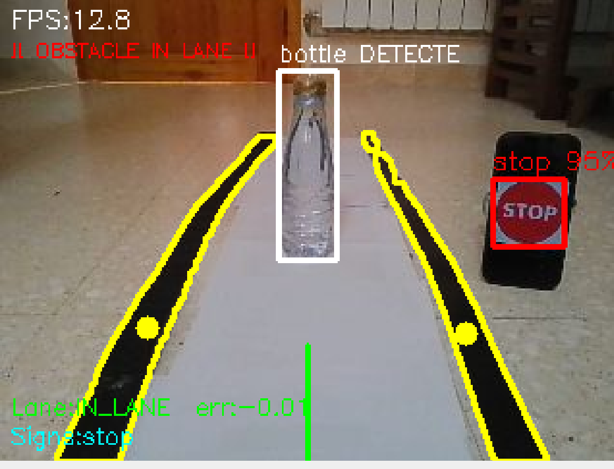
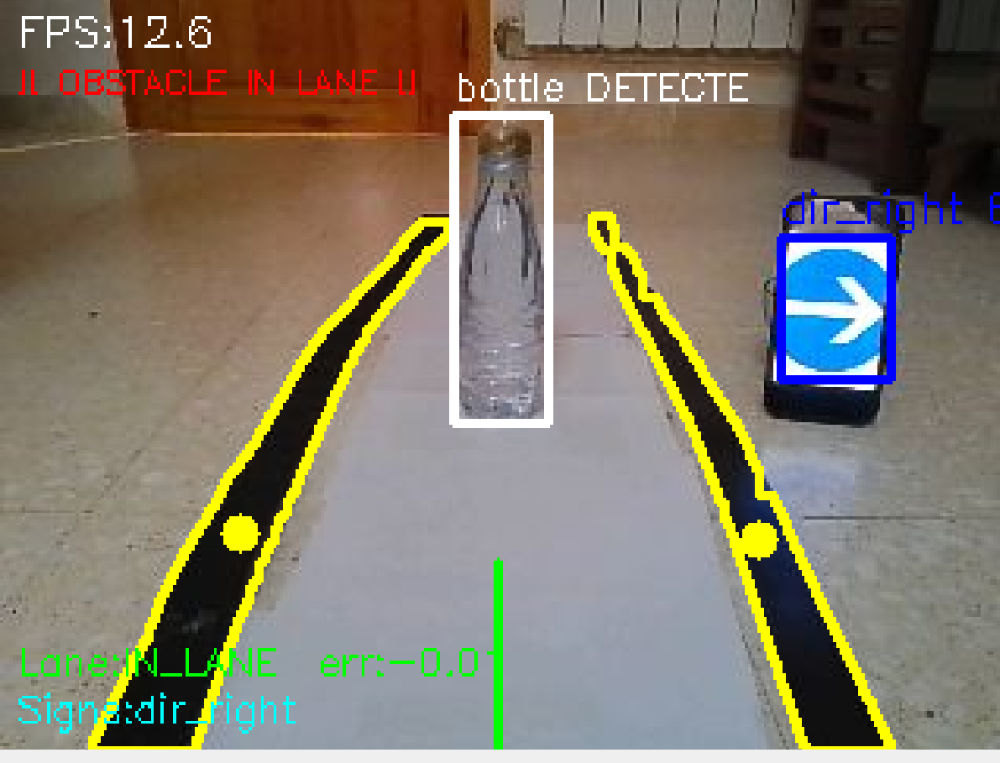

# esibot_vision

Package ROS2 Jazzy — Vision temps réel pour le robot EsiBot.

Détecte en temps réel :
- **Voie** : ruban adhésif noir sur fond blanc (OpenCV)
- **Panneaux de signalisation** : YOLOv8n finetuné sur GTSRB (8 classes)
- **Obstacles** : YOLOv8n COCO — uniquement entre les deux rubans

---

## Panneaux détectés

| Panneau | Image | Label |
|---------|-------|-------|
| Stop |  | `stop` |
| Limite 30 km/h |  | `speed_30` |
| Direction droite |  | `dir_right` |

Classes complètes : `speed_30` `speed_50` `speed_70` `speed_80` `stop` `dir_straight` `dir_right` `dir_left`

---

## Prérequis

- Ubuntu 24.04 + ROS2 Jazzy
- Package `esibot_camera` lancé (fournit `/camera/image_raw`)
- Python : `opencv-python`, `numpy`, `ultralytics` (YOLOv8)

---

## Installation sur Raspberry Pi

### 1. Dépendances système

```bash
sudo apt update
sudo apt install -y python3-pip python3-numpy python3-opencv
```

### 2. PyTorch CPU-only (~190 MB — obligatoire, pas de GPU sur Raspberry Pi)

```bash
pip3 install torch torchvision --index-url https://download.pytorch.org/whl/cpu \
    --break-system-packages
```

### 3. Ultralytics YOLOv8 sans dépendances CUDA (~10 MB)

```bash
pip3 install ultralytics --no-deps --break-system-packages
pip3 install ultralytics-thop lap --break-system-packages
```

### 4. Build du package

```bash
cd ~/esibot_ws
colcon build --symlink-install --packages-select esibot_vision
source install/setup.bash
```

### 5. Modèles YOLOv8

Les modèles **ne sont pas versionnés** dans git (trop lourds). À placer dans `models/` manuellement.

| Fichier | Taille | Source |
|---------|--------|--------|
| `yolov8n.pt` | 6.3 MB | [Télécharger ici](https://github.com/ultralytics/assets/releases/download/v8.3.0/yolov8n.pt) |
| `signs_best.pt` | 18 MB | Disponible auprès du mainteneur du projet (entraîné sur GTSRB) |

```bash
# Placer les fichiers dans :
~/esibot_ws/src/esibot_vision/models/yolov8n.pt
~/esibot_ws/src/esibot_vision/models/signs_best.pt
```

---

## Lancement

**Terminal 1 — caméra :**
```bash
ros2 launch esibot_camera esibot_camera.launch.py esp32_ip:=192.168.1.80
```

**Terminal 2 — vision :**
```bash
ros2 launch esibot_vision vision.launch.py \
  sign_model_path:=~/esibot_ws/src/esibot_vision/models/signs_best.pt \
  obstacle_model_path:=~/esibot_ws/src/esibot_vision/models/yolov8n.pt
```

**Visualisation :**
```bash
ros2 run rqt_image_view rqt_image_view /camera/image_annotated
```

---

## Topics

| Topic | Type | Description |
|-------|------|-------------|
| `/image_raw` | `sensor_msgs/Image` | Souscrit (remappé → `/camera/image_raw`) |
| `/camera/image_annotated` | `sensor_msgs/Image` | Image annotée avec détections |
| `/esibot/lane_error` | `std_msgs/Float32` | Erreur voie : -1.0 (gauche) … +1.0 (droite) |
| `/esibot/lane_status` | `std_msgs/String` | `IN_LANE` \| `LANE_LEFT` \| `LANE_RIGHT` \| `NO_LANE` |
| `/esibot/signs` | `std_msgs/String` | JSON — panneaux confirmés |
| `/esibot/obstacles` | `std_msgs/String` | JSON — obstacles en voie |
| `/esibot/obstacle_in_lane` | `std_msgs/Bool` | `true` si obstacle bloque la voie |

---

## Configuration — `config/vision_params.yaml`

| Paramètre | Défaut | Description |
|-----------|--------|-------------|
| `lane_roi_ratio` | `1.0` | Fraction image utilisée pour la voie |
| `lane_threshold` | `60` | Seuil binarisation (pixels < threshold = noir) |
| `lane_min_area` | `200` | Aire minimale contour ruban (px²) |
| `sign_conf` | `0.60` | Seuil confiance panneaux (stop = 0.85 fixe) |
| `obstacle_conf` | `0.40` | Seuil confiance obstacles |
| `lane_width_ratio` | `0.50` | Zone voie centrale (si rubans non détectés) |
| `publish_annotated` | `true` | Publier image annotée |
| `process_rate` | `15.0` | Fréquence traitement (Hz) |

---

## Entraîner le modèle panneaux (optionnel)

```bash
# 1. Préparer le dataset GTSRB
python3 scripts/prepare_gtsrb.py \
    --csv /chemin/vers/GTSRB/Train.csv \
    --img-dir /chemin/vers/GTSRB/Train \
    --output dataset/

# 2. Entraîner
python3 scripts/train_signs.py \
    --dataset dataset/dataset.yaml \
    --output models/ \
    --epochs 50 \
    --device cpu
```

---

## Structure

```
esibot_vision/
├── esibot_vision/
│   ├── vision_node.py       ← nœud ROS2 principal
│   ├── lane_detector.py     ← détection rubans (OpenCV)
│   ├── sign_detector.py     ← détection panneaux (YOLOv8n)
│   ├── obstacle_detector.py ← détection obstacles (YOLOv8n)
│   ├── config.py            ← constantes et classes
│   └── utils.py             ← FPSCounter + draw_hud
├── launch/
│   └── vision.launch.py
├── config/
│   └── vision_params.yaml
├── scripts/
│   ├── prepare_gtsrb.py
│   └── train_signs.py
├── models/                  ← .pt non versionnés (voir .gitignore)
└── docs/images/             ← captures panneaux
```
